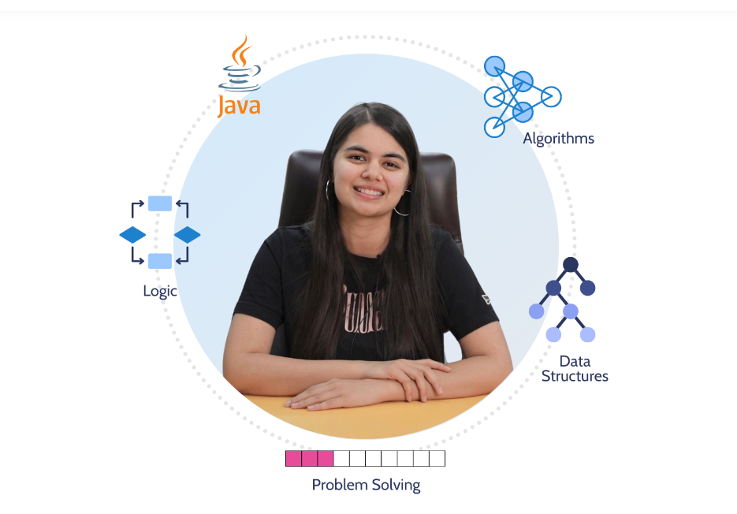

# Java-DSA-Bootcamp

# My Coding Journey

Welcome to my coding journey! This repository is a record of my progress as I learn the fundamentals of programming and build small projects. I'm excited to share my experiences, challenges, and victories as I embark on this path.

## About Me

Hi, I'm Dikshant, an aspiring developer passionate about technology and problem-solving. I'm new to coding, and I'm here to learn, experiment, and document my journey from the basics to more advanced topics.

## Goals

- **Learn Programming Fundamentals:** Understand variables, control structures, functions, and object-oriented programming.
- **Build Projects:** Start with simple projects like "Hello World" programs and gradually work on more complex applications.
- **Master Data Structures & Algorithms:** Develop a solid foundation in essential data structures and algorithms.
- **Collaborate & Contribute:** Engage with the coding community, seek feedback, and contribute to open-source projects.

## Learning Path

- **Programming Languages:**  
  Starting with languages like Python and JavaScript. As I progress, I'll explore Java, C++, or others that fit my learning goals.
  
- **Concepts to Explore:**  
  - Basics (syntax, loops, conditionals)
  - Data Structures (arrays, lists, stacks, queues)
  - Algorithms (sorting, searching, recursion)
  - Version Control with Git and GitHub

- **Resources:**  
  - [Codecademy](https://www.codecademy.com/)
  - [freeCodeCamp](https://www.freecodecamp.org/)
  - [W3Schools](https://www.w3schools.com/)
  - [GitHub Learning Lab](https://lab.github.com/)

## Projects

Here are a few projects that I'll be working on:

- **Hello World:**  
  My very first project to get familiar with the basics of a programming language.

- **Simple Calculator:**  
  A project to practice using functions and handling user input.

- **To-Do List Application:**  
  A small application to manage tasks and learn about user interface design and data handling.

*More projects will be added as I learn and grow in my coding skills.*

## How to Use This Repository

- **Explore the Code:**  
  Each project is organized in its own folder with code, documentation, and notes on what I've learned.
  
- **Follow My Progress:**  
  Check out the commit history and project updates to see how my skills evolve over time.

- **Contribute or Suggest:**  
  If you have advice, resources, or improvements, feel free to open an issue or submit a pull request.

## Contact

I'm always excited to connect with fellow learners and mentors!  
I mentioned my all the link in my profile section 

## Acknowledgements

Thank you to the many online communities, mentors, and educators who provide free resources and support to beginners like me. Your contributions make this journey possible!

Let's code, learn, and grow together!
